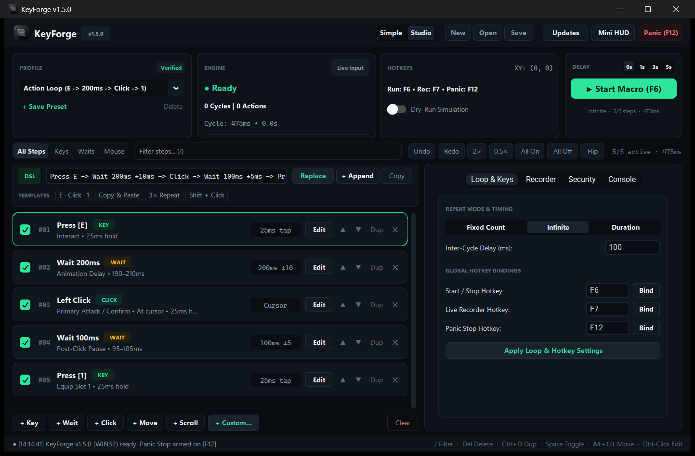
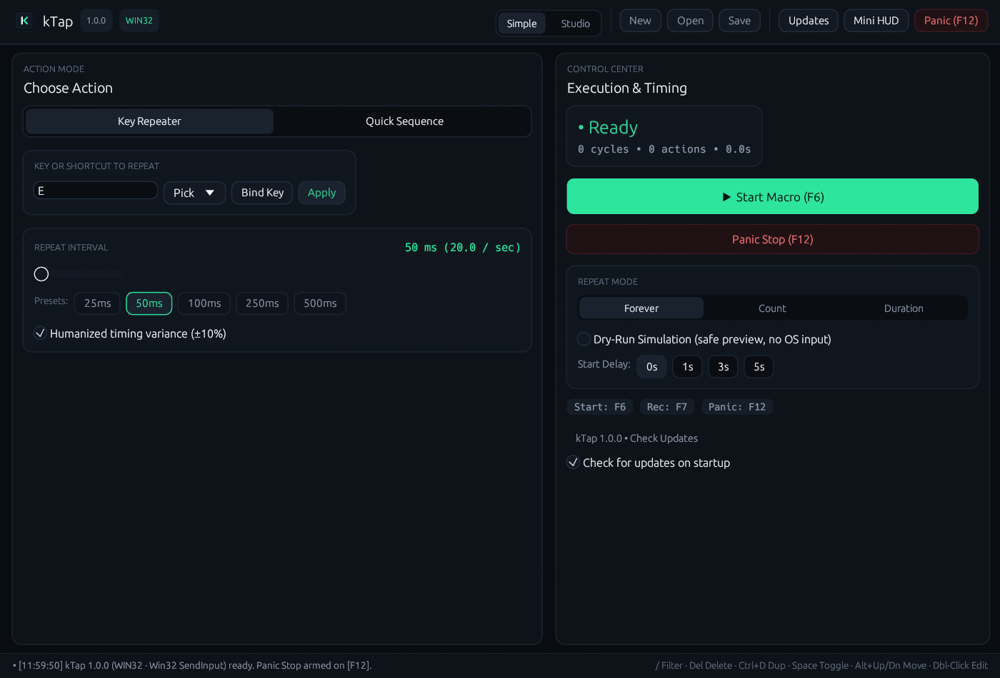
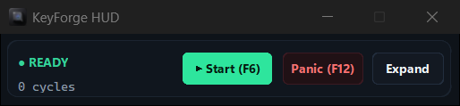
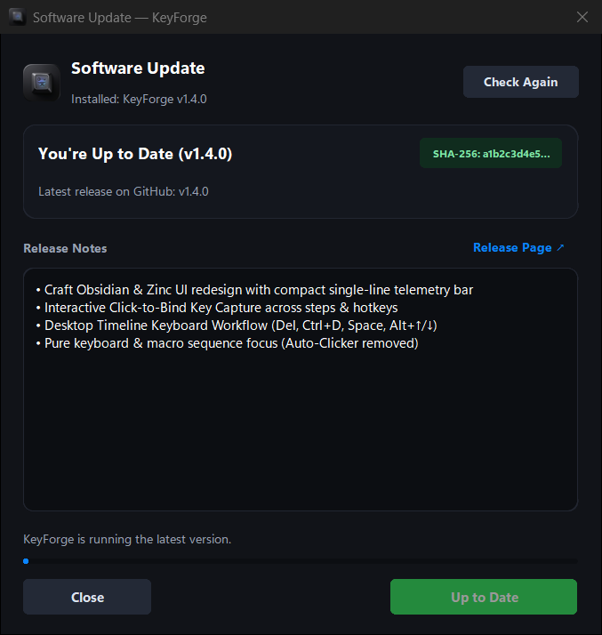
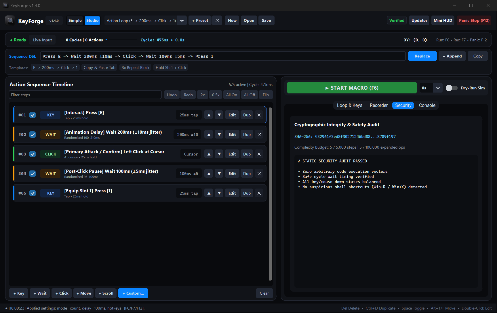
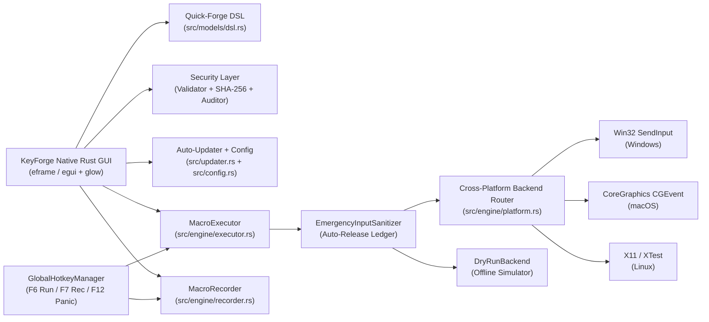

<div align="center">


# KeyForge

**Precision Native Rust Keyboard & Macro Sequence Studio & Live Input Recorder.**  
Free, Open-Source (`GPL-3.0-or-later`), Cybersecurity-Hardened, Obsidian & Mint Emerald GUI, and Native for Windows, macOS & Linux — with Zero Python Runtime or WebView Bloat.

[](https://github.com/efeartn/KeyForge/actions/workflows/ci.yml)
[](https://github.com/efeartn/KeyForge/releases/latest)
[](https://github.com/efeartn/KeyForge/releases/latest)
[](Cargo.toml)
[](SECURITY.md)
[](LICENSE)

[**Download v2.0.0**](#download-standalone-executables) • [**Release Notes**](RELEASE_NOTES.md) • [**Visual Tour**](#visual-tour) • [**Cross-Platform Engine**](#cross-platform-support-windows--macos--linux) • [**Setup Installer & Updater**](#setup-installer--auto-updater) • [**Sequence DSL**](#sequence-dsl-reference) • [**Cybersecurity**](#cybersecurity--safety-engineering) • [**CLI & Source**](#installation--quick-start)

</div>

---

## Studio Workspace at a Glance

<div align="center">
  
  <br />
  <sub><b>Studio Mode</b> — Decluttered top utility header, <b>4-Card Hero Control Strip</b> (Profile, Engine Telemetry, Hotkeys &amp; Dry-Run, Delay &amp; Start CTA), <b>All Steps / Keys / Waits / Mouse</b> filter pills with <code>/</code> quick search, crisp non-truncated step cards, keyboard shortcuts (<code>Del</code> / <code>Ctrl+D</code> / <code>Space</code> / <code>Alt+↑/↓</code>), and compact <b>Mini HUD</b> — now powered by GPU-accelerated native Rust (<code>eframe</code> / <code>egui</code>).</sub>
</div>

---

## Visual Tour

### Dual Workspaces: `Simple` & `Studio`

KeyForge adapts smoothly from quick keyboard automation to full multi-step sequence engineering without forcing complex timelines onto everyday workflows — styled uniformly in `v2.0.0` with deep charcoal-obsidian surfaces (`#090C10` / `#0E1319`), hairline `1px` borders, and a restrained Mint Emerald CTA (`#2EE59D`).

<table>
  <tr>
    <td width="58%" valign="top">
      
    </td>
    <td width="42%" valign="top">
      <h3>Everyday Keyboard Automation</h3>
      <ul>
        <li><b>Two Synchronized Modes:</b> Toggle cleanly between <b>Simple</b> (Key Repeater &amp; Quick Sequence) and <b>Studio</b> (4-card hero strip + timeline) with live bidirectional profile, delay, and repeat-count sync.</li>
        <li><b>Click-to-Bind Key Capture &amp; Presets:</b> Click <b>Bind Key</b> to capture any physical key or modifier combo (e.g. <code>Ctrl+Shift+F</code> or <code>Cmd+C</code> on macOS), use speed presets (<code>25ms–500ms</code>), or save custom profiles via <b>+ Save Preset</b>.</li>
        <li><b>Fast Step Filtering &amp; Shortcuts:</b> Slice steps by <b>Keys</b>, <b>Waits</b>, or <b>Mouse</b>, press <code>/</code> to filter, and manage visible rows safely via <code>Del</code>, <code>Ctrl+D</code> / <code>⌘D</code>, <code>Space</code>, and <code>Alt+↑/↓</code>.</li>
        <li><b>Native Rust Efficiency:</b> Rewritten 100% in compiled native Rust (<code>eframe</code> / <code>egui</code> + <code>glow</code>) with zero Python interpreter, zero Electron/WebView subprocesses, a <b>5.84 MB</b> standalone Windows executable (<code>6,124,032</code> bytes), and <b>0.065%</b> idle CPU on Windows (<code>142.13 MB</code> private OpenGL WGL context footprint).</li>
      </ul>
    </td>
  </tr>
</table>

### Floating Mini-HUD & Setup Installer Wizard

<table>
  <tr>
    <td width="50%" valign="top" align="center">
      <br />
      
      <br /><br />
      <p align="left">
        <b>Compact Always-on-Top Mini-HUD</b><br />
        Click <b>Mini HUD</b> in the header bar to collapse KeyForge into a slim floating control pill that stays above games or desktop workflows on Windows, macOS Retina, and Linux with live cycle telemetry, Start/Stop (<code>F6</code>), Panic (<code>F12</code>), and one-click <b>Expand</b>.
      </p>
    </td>
    <td width="50%" valign="top" align="center">
      
      <p align="left">
        <b>Cross-Platform Setup Installer &amp; Uninstaller</b><br />
        Install per-user without admin elevation (<code>%LOCALAPPDATA%\Programs\KeyForge</code> on Windows, <code>~/Applications/KeyForge</code> on macOS, <code>~/.local/share/KeyForge</code> on Linux) with native shortcuts / <code>.desktop</code> launchers while preserving user configs &amp; macros by default.
      </p>
    </td>
  </tr>
</table>

### Modal Step Editor & Cryptographic In-App Updater

<table>
  <tr>
    <td width="50%" valign="top" align="center">
      
      <p align="left">
        <b>Precision Step Inspector</b><br />
        Double-click any step (or click <code>Edit</code>) to configure readable action modes, capture keys directly with <b>Bind Key</b>, build nested <code>Repeat</code> loops, or capture live screen coordinates with <b>Pick XY</b>.
      </p>
    </td>
    <td width="50%" valign="top" align="center">
      
      <p align="left">
        <b>Startup Check &amp; SHA-256 Auto-Updater</b><br />
        Checks GitHub Releases cleanly on launch, displays release notes and SHA-256 status, verifies downloads via <code>SHA256SUMS.txt</code> with constant-time <code>subtle::ConstantTimeEq</code>, and stages non-destructive upgrades while keeping every setting and macro intact.
      </p>
    </td>
  </tr>
</table>

### Built-In Static Security Audit & Integrity Verification

<div align="center">
  
  <br />
  <sub><b>Live Security Inspector Tab</b> — Displays the active profile's canonical <code>SHA-256</code> integrity digest, complexity budget counters, and real-time <code>KF-SEC-001..005</code> static safety checks.</sub>
</div>

---

## Download Standalone Executables

Every tagged release is compiled with Cargo `--release`, checked with `rustfmt` and `clippy -D warnings`, tested across all OS targets by [GitHub Actions](https://github.com/efeartn/KeyForge/actions), and published alongside individual checksums and a combined [`SHA256SUMS.txt`](https://github.com/efeartn/KeyForge/releases/latest/download/SHA256SUMS.txt):

| Operating System | Variant | Standalone Binary | Checksum Manifest |
| :--- | :--- | :--- | :--- |
| **Windows 10 / 11** (`x64`) | **Setup Installer** (Shortcuts + Uninstaller) | [**`KeyForge-Setup-Windows-x64.exe`**](https://github.com/efeartn/KeyForge/releases/latest/download/KeyForge-Setup-Windows-x64.exe) | [`KeyForge-Setup-Windows-x64.sha256.txt`](https://github.com/efeartn/KeyForge/releases/latest/download/KeyForge-Setup-Windows-x64.sha256.txt) |
| **Windows 10 / 11** (`x64`) | **Portable Single-File** | [**`KeyForge-Windows-x64.exe`**](https://github.com/efeartn/KeyForge/releases/latest/download/KeyForge-Windows-x64.exe) | [`KeyForge-Windows-x64.sha256.txt`](https://github.com/efeartn/KeyForge/releases/latest/download/KeyForge-Windows-x64.sha256.txt) |
| **macOS** (`arm64`) | **Apple Silicon Standalone** | [**`KeyForge-macOS-arm64`**](https://github.com/efeartn/KeyForge/releases/latest/download/KeyForge-macOS-arm64) | [`KeyForge-macOS-arm64.sha256.txt`](https://github.com/efeartn/KeyForge/releases/latest/download/KeyForge-macOS-arm64.sha256.txt) |
| **Linux** (`x86_64`) | **Standalone ELF Binary** | [**`KeyForge-Linux-x64`**](https://github.com/efeartn/KeyForge/releases/latest/download/KeyForge-Linux-x64) | [`KeyForge-Linux-x64.sha256.txt`](https://github.com/efeartn/KeyForge/releases/latest/download/KeyForge-Linux-x64.sha256.txt) |

<details>
<summary><b>Verify Binary Checksum Before Running (Optional)</b></summary>

```powershell
# Windows (PowerShell)
Get-FileHash .\KeyForge-Setup-Windows-x64.exe -Algorithm SHA256
Get-FileHash .\KeyForge-Windows-x64.exe -Algorithm SHA256
```

```bash
# macOS
shasum -a 256 KeyForge-macOS-arm64 && chmod +x KeyForge-macOS-arm64

# Linux
sha256sum -c KeyForge-Linux-x64.sha256.txt && chmod +x KeyForge-Linux-x64
```

</details>

---

## Cross-Platform Support (Windows · macOS · Linux)

KeyForge injects live keyboard/mouse events, polls global hotkeys, and captures live input natively on every desktop OS directly via Rust FFI (`windows-sys`, `CoreGraphics` / `ApplicationServices`, and `libX11` / `libXtst`):

| Platform | Native Input & Hotkey Engine | Permissions & Notes |
| :--- | :--- | :--- |
| **Windows 10 / 11** | `Win32InputBackend` (`src/engine/platform_win32.rs`: `SendInput`, `GetAsyncKeyState`) | Works immediately out of the box with `0x4B465247` self-filter signature |
| **macOS (Apple Silicon / Intel)** | `MacOSInputBackend` (`src/engine/platform_macos.rs`: `CGEventPost`, non-variadic scroll, `CGEventSourceKeyState`) | Grant **Accessibility** permission in *System Settings → Privacy & Security → Accessibility* for live injection & global hotkeys; supports `Cmd` / `Option` aliases and `⌘` shortcuts |
| **Linux (`x86_64` / `arm64`)** | `LinuxX11InputBackend` (`src/engine/platform_linux.rs`: `libX11` + `libXtst`, dedicated `Display*`, `XQueryKeymap`) | Works on X11 and XWayland windows (`libxtst6` required; isolated pure-Wayland sessions fall back safely to Dry-Run Simulation with guidance) |

---

## Setup Installer & Auto-Updater

### Safe Setup & Uninstaller (Preserves User Data by Default)
- **Zero-Elevation Per-User Install**: Installs cleanly into your user folder (`%LOCALAPPDATA%\Programs\KeyForge\KeyForge.exe` on Windows, `~/Applications/KeyForge/KeyForge` on macOS, `~/.local/share/KeyForge/KeyForge` on Linux) with native folder picker (**Browse...** via `rfd`).
- **Native Shortcuts & Registration**: Creates optional Desktop shortcuts and Windows Start Menu / Uninstall registry entries or Linux `.desktop` Application Menu launchers, and automatically sets `0755` executable permissions on POSIX.
- **Uninstall Without Data Loss**: Running Uninstall removes binaries and shortcuts while leaving your configuration, custom presets, and active macro profile intact by default unless `--purge-data` is selected, and includes host protection guards under test runners.
- **Silent CLI Support**: Both Setup and Uninstall support headless flags (`--install --silent` and `--uninstall --silent [--purge-data]`).

### Auto-Updater & 100% `v1.x` Configuration Compatibility

Upgrading directly from KeyForge `v1.x` (Python) to `v2.0.0` (Rust) preserves your existing settings, hotkeys, UI mode, Key Repeater interval, start delay, custom presets, window geometry, and signed `.kfmacro.json` macro profiles automatically — byte-for-byte compatible canonical SHA-256 verification included.

- **Startup Release Check**: Background check on startup notifies you cleanly via a dismissible header banner and the **Updates** pill when a newer release exists on GitHub (can be toggled anytime with **Check for updates on startup**).
- **Strict Transport & Hash Verification**: Enforces `HTTPS`-only GitHub redirects, matches portable binaries cleanly without confusing them for installers, streams downloads atomically with progress reporting, rejects any download whose `SHA-256` fails constant-time comparison against `SHA256SUMS.txt` / `.sha256.txt`, and executes non-destructive staged hot-swap replacement (`$TargetExe.new` -> `.old` backup -> atomic promote).
- **Crash-Safe Config, Custom Presets & Profile Storage** (atomic temp-write + `.bak` fallback; overridable via `KEYFORGE_CONFIG_DIR`):

| Platform | Configuration Directory | Stored Files |
| :--- | :--- | :--- |
| **Windows** | `%APPDATA%\KeyForge` | `config.json`, `active_profile.kfmacro.json` (+ `.bak`), `presets/` |
| **macOS** | `~/Library/Application Support/KeyForge` | `config.json`, `active_profile.kfmacro.json` (+ `.bak`), `presets/` |
| **Linux / BSD** | `$XDG_CONFIG_HOME/KeyForge` (or `~/.config/KeyForge`) | `config.json`, `active_profile.kfmacro.json` (+ `.bak`), `presets/` |

---

## Why KeyForge?

Many desktop macro tools force a trade-off between usability, performance, and safety:

| Feature / Guarantee | **KeyForge (`GPL-3.0`)** | **TinyTask** | **AutoHotkey** | **Paid Macro Tools** |
| :--- | :---: | :---: | :---: | :---: |
| **100% Free, Native Rust & Open Source** | ✅ Yes (~5.8 MB single binary) | ❌ Closed binary | ✅ Yes | ❌ Paywalls / Bloat |
| **Simple Key Repeater + Visual Studio** | ✅ Dual UI Modes | ❌ Record-only blob | ❌ Scripts only | ⚠️ Often split tiers |
| **One-Line Sequence DSL Bar** | ✅ `Press E -> Wait 200ms -> Click` | ❌ No | ❌ Manual script | ❌ No |
| **Humanized Random Jitter (`±ms`)** | ✅ Built into Wait steps | ❌ Fixed delays | ⚠️ Manual `Random()` | ❌ Rare |
| **Auto-Release Stuck Keys on Abort** | ✅ `EmergencyInputSanitizer` | ❌ Leaves Shift/Ctrl stuck | ❌ Manual cleanup | ⚠️ Unreliable |
| **SHA-256 Signed Profiles + Static Auditor** | ✅ Yes (`KF-SEC-001..005`) | ❌ Unverified binary blobs | ❌ Arbitrary execution | ❌ Closed format |
| **In-App Verified Updater + Config Sync** | ✅ HTTPS + SHA-256 | ❌ None | ⚠️ External installer | ⚠️ Telemetry-heavy |
| **Cross-Platform Native Binaries** | ✅ Windows, macOS & Linux | ⚠️ Windows only | ⚠️ Windows only | ⚠️ Windows only |

---

## Sequence DSL Reference

Type or paste human-readable macro recipes directly into the **Sequence DSL** bar and press `Enter` (or click **Replace** / **+ Append**):

| Action | Sequence DSL Syntax Examples | Description |
| :--- | :--- | :--- |
| **Key Tap** | `Press E` • `Press Space` • `Press 1 (hold 40ms)` | Presses and releases a key with configurable hold time |
| **Modifier Combo** | `Press Ctrl+Shift+E` • `Press Alt+F` | Holds modifiers in order, taps primary key, releases in reverse |
| **Key Hold / Release** | `KeyDown Shift` • `KeyUp Shift` | Explicit key state transitions (auto-sanitized on stop) |
| **Mouse Click** | `Click` • `Click Right` • `DoubleClick Left at (640, 480)` | Single, double, down, or up click at live cursor or fixed `(X, Y)` |
| **Mouse Move** | `Move (500, 500)` • `Move (+120, -40) rel` | Absolute screen coordinates or relative pixel delta |
| **Mouse Scroll** | `Scroll -3` • `Scroll +5` | Vertical (`+Up` / `-Down`) mouse wheel scrolling |
| **Wait + Jitter** | `Wait 200ms` • `Wait 150ms ±20ms` • `Wait 1.5s` | High-precision interruptible sleep with optional humanization jitter |
| **Nested Repeat** | `Repeat 3 { Press F -> Wait 120ms ±15ms } -> Click` | Repeats an inner sequence `N` times inside the main macro loop |

### Live Input Recorder (`F7`) & Hardware Panic Kill-Switch (`F12`)

- **Live Recorder (`F7`)**: Records real-time keyboard and mouse inputs into editable timeline cards, automatically coalesces `KeyDown + KeyUp` taps, and filters out KeyForge's own `0x4B465247` (`"KFRG"`) synthetic injection marker and active hotkeys.
- **Panic Kill-Switch (`F12`)**: Interrupts running macros immediately — even mid-`Wait` — and invokes **`EmergencyInputSanitizer`** to dispatch matching `KeyUp` / `MouseUp` events in reverse order so `Shift`, `Ctrl`, or mouse buttons never stay stuck down.

---

## Cybersecurity & Safety Engineering

KeyForge is built with defensive local and supply-chain safeguards documented in [`SECURITY.md`](SECURITY.md):

1. **Declarative JSON Profiles (Zero `eval` / `exec` / Arbitrary Scripts)**: `.kfmacro.json` files validate strictly against allowlists, bounds, and types in [`src/security/validator.rs`](src/security/validator.rs), rejecting `NaN`/`Infinity`, boolean-as-integer confusion, path traversal, NTFS ADS (`:`), and reserved device names (`CON`, `NUL`, `COM1`).
2. **Canonical `SHA-256` Signing**: Profiles embed an `integrity_sha256` digest computed via `sha2` and verified using constant-time `subtle::ConstantTimeEq` in [`src/security/integrity.rs`](src/security/integrity.rs) with full parity against `v1.x` profiles.
3. **Anti-DoS Complexity Budgets**: Caps `MAX_PROFILE_FILE_BYTES = 1 MiB`, `MAX_TOTAL_STEPS = 5,000`, `MAX_NESTING_DEPTH = 5`, `MAX_EXPANDED_OPS_PER_CYCLE = 100,000`, plus a `5ms` minimum inter-cycle flood governor.
4. **Built-In Static Security Auditor ([`src/security/auditor.rs`](src/security/auditor.rs))**:

| Rule Code | Severity | Security & Safety Check |
| :--- | :--- | :--- |
| **`KF-SEC-001`** | `WARNING` | Detects zero-wait infinite loops and confirms the `5ms` anti-flood governor is active |
| **`KF-SEC-002`** | `WARNING` | Detects unbalanced `KeyDown` / `MouseDown` actions without matching release steps |
| **`KF-SEC-003`** | `CRITICAL` | Flags suspicious shell/system shortcuts (`Win+R`, `Win+X`, `Alt+F4`), including split `KeyDown RWin -> Press R` sequences |
| **`KF-SEC-004`** | `WARNING` | Flags extreme mouse click rates (`> 100 CPS`) |
| **`KF-SEC-005`** | `INFO` | Alerts when a step injects a key also bound as a KeyForge control hotkey (`0x4B465247` self-filter active) |

---

## Architecture & Repository Layout


```mermaid
flowchart LR
    UI["KeyForge Native Rust GUI<br/>(eframe / egui + glow)"] --> DSL["Quick-Forge DSL<br/>(src/models/dsl.rs)"]
    UI --> SEC["Security Layer<br/>(Validator + SHA-256 + Auditor)"]
    UI --> UPD["Auto-Updater + Config<br/>(src/updater.rs + src/config.rs)"]
    UI --> EXEC["MacroExecutor<br/>(src/engine/executor.rs)"]
    UI --> REC["MacroRecorder<br/>(src/engine/recorder.rs)"]
    HK["GlobalHotkeyManager<br/>(F6 Run / F7 Rec / F12 Panic)"] --> EXEC
    HK --> REC
    EXEC --> SAN["EmergencyInputSanitizer<br/>(Auto-Release Ledger)"]
    SAN --> PLAT["Cross-Platform Backend Router<br/>(src/engine/platform.rs)"]
    PLAT --> WIN32["Win32 SendInput<br/>(Windows)"]
    PLAT --> MAC["CoreGraphics CGEvent<br/>(macOS)"]
    PLAT --> X11["X11 / XTest<br/>(Linux)"]
    SAN --> DRY["DryRunBackend<br/>(Offline Simulator)"]
```

```text
KeyForge/
├── .github/workflows/ci.yml      # Multi-OS Rust fmt, clippy, test & Release Pipeline
├── assets/                       # Embedded Window & Installer Icons (icon.png, icon.ico)
├── docs/screenshots/             # README Desktop Interface & Dialog Screenshots
├── src/
│   ├── engine/
│   │   ├── backend.rs            # InputBackend Trait, Marker & DryRunBackend Simulator
│   │   ├── executor.rs           # Interruptible MacroExecutor, Sanitizer & Telemetry
│   │   ├── hotkeys.rs            # Adaptive Cross-Platform Global Hotkey Polling Thread
│   │   ├── platform.rs           # Platform Backend Factory (Win32 / macOS / X11)
│   │   ├── platform_win32.rs     # Native 64-bit Win32 SendInput & GetAsyncKeyState
│   │   ├── platform_macos.rs     # Native macOS CoreGraphics CGEvent & AX Trust Check
│   │   ├── platform_linux.rs     # Native Linux libX11 + libXtst Input & Query Backend
│   │   └── recorder.rs           # Live Input Recorder with Tap Coalescing & Combo Filter
│   ├── models/
│   │   ├── action.rs             # MacroAction Struct, ActionType & Bounds Validation
│   │   ├── dsl.rs                # Sequence DSL Parser & Canonical Formatter
│   │   ├── keymap.rs             # Virtual-Key (VK), Scan-Code & Cross-OS Key Registry
│   │   └── profile.rs            # MacroProfile, RepeatMode & Built-In Starter Presets
│   ├── security/
│   │   ├── auditor.rs            # Static Security & Safety Analyzer (KF-SEC-001..005)
│   │   ├── integrity.rs          # Canonical SHA-256 Signing & Constant-Time Verification
│   │   └── validator.rs          # Allowlist Schema, Path & Complexity Budget Validator
│   ├── ui/
│   │   ├── app.rs                # Dual Simple/Studio Obsidian Desktop GUI & 4-Card Hero
│   │   ├── installer_window.rs   # Cross-Platform Setup & Uninstaller Wizard with Browse...
│   │   ├── mini_hud.rs           # Always-on-Top Floating Compact Control Pill
│   │   ├── step_dialog.rs        # Modal Step Inspector with Bind Key & Pick XY Capture
│   │   ├── theme.rs              # Obsidian/Emerald Palette & Native Window Styling
│   │   └── update_dialog.rs      # SHA-256 Verified GitHub Releases Update Sheet
│   ├── config.rs                 # Crash-Safe Config, Custom Presets & Active Profile Backup
│   ├── installer.rs              # Per-User Installer, Desktop Launchers & Registry Manager
│   ├── lib.rs                    # Library Crate Root (VERSION = "2.0.0")
│   ├── main.rs                   # Setup Wizard, CLI & Desktop GUI Entry Point
│   └── updater.rs                # SemVer Client, SHA-256 Verifier & Non-Destructive Hot-Swapper
├── tests/integration_tests.rs    # Full Rust Integration, SHA-256 Parity & CLI Smoke Suite
├── build.rs                      # Windows MSVC Resource Embedding
├── Cargo.toml                    # Dependencies & Size/Speed Optimized Release Profile
└── RELEASE_NOTES.md              # Latest Release Notes (Published to GitHub Releases)
```

---

## Installation & Quick Start

### Run from Source (Rust Toolchain)

```bash
git clone https://github.com/efeartn/KeyForge.git
cd KeyForge

# Launch KeyForge Desktop GUI (release optimized)
cargo run --release
```

### Command-Line Interface (CLI)

```bash
# Check installed version
cargo run -- --version

# Simulate a Quick-Forge recipe in safe Dry-Run mode (no live OS inputs)
cargo run -- --expr "Press E -> Wait 200ms -> Click -> Press 1" --repeat 3 --dry-run

# Export the signed starter profile
cargo run -- --export-default my_combo.kfmacro.json

# Run the static security & safety audit on a saved profile
cargo run -- --profile my_combo.kfmacro.json --audit

# Execute a saved profile with live OS injection
cargo run -- --profile my_combo.kfmacro.json

# Launch Setup / Install / Uninstall workflows
cargo run -- --setup
cargo run -- --install --silent
cargo run -- --uninstall --silent
```

### Compile Standalone Binary & Run Tests

```bash
# Build single-file release executable under target/release/
cargo build --release --locked

# Run formatting, clippy (-D warnings), and full integration tests
cargo fmt --all -- --check
cargo clippy --all-targets -- -D warnings
cargo test --all-targets
```

---

## License & Security Policy

- **License**: Distributed under the [**GNU General Public License v3.0**](LICENSE).
- **Security Policy**: See [**SECURITY.md**](SECURITY.md) for architecture threat models, auto-updater verification details, and vulnerability disclosure guidelines.
